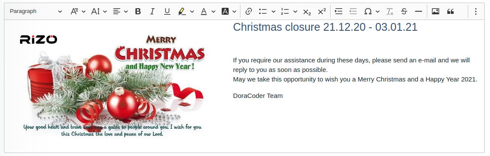

# CKEditor 5 editor generated with the online builder

This repository presents a CKEditor 5 editor build generated by the [Online builder tool](https://ckeditor.com/ckeditor-5/online-builder)

## Usage (ReactJS)

### Create TextEditor component

```javascript
// text-editor.js
import React from 'react'
import {CKEditor} from '@ckeditor/ckeditor5-react'
import ClassicEditor from '@doracoder/ckeditor5-custom-build/build/ckeditor'
import {API_URL} from '../../shared/config';
import './reset.css';

function TextEditor({value, onChange}) {
    const custom_config = {
        extraPlugins: [MyCustomUploadAdapterPlugin],
        allowedContent: 'p b i; a[!href] table',
        image: {
            toolbar: [
                'imageStyle:alignLeft', 'imageStyle:alignCenter', 'imageStyle:alignRight',
                '|',
                'imageResize',
                '|',
                'imageTextAlternative'
            ],
            styles: [
                'alignLeft', 'alignCenter', 'alignRight'
            ],
            resizeOptions: [
                {
                    name: 'imageResize:original',
                    label: 'Original',
                    value: null
                },
                {
                    name: 'imageResize:50',
                    label: '50%',
                    value: '50'
                },
                {
                    name: 'imageResize:75',
                    label: '75%',
                    value: '75'
                }
            ],
        },
        toolbar: {
            items: [
                'heading',
                'fontFamily',
                'fontSize',
                'alignment',
                'bold',
                'italic',
                'underline',
                'highlight',
                'fontColor',
                'fontBackgroundColor',
                '|',
                'link',
                'bulletedList',
                'numberedList',
                'subscript',
                'superscript',
                '|',
                'indent',
                'outdent',
                'specialCharacters',
                'removeFormat',
                'strikethrough',
                'horizontalLine',
                '|',
                'imageUpload',
                'blockQuote',
                'insertTable',
                'mediaEmbed',
                'undo',
                'redo',
                'exportPdf',
                'MathType',
                'ChemType'
            ]
        },
        table: {
            contentToolbar: ['tableColumn', 'tableRow', 'mergeTableCells']
        },
        language: 'en'
    }

    return (
        <div className="yui3-cssreset">
            <CKEditor
                required
                editor={ClassicEditor}
                config={custom_config}
                data={value}
                onChange={(event, editor) => {
                    onChange(editor)
                }}
            />
        </div>
    )
}

function MyCustomUploadAdapterPlugin(editor) {
    editor.plugins.get('FileRepository').createUploadAdapter = (loader) => {
        return new MyUploadAdapter(loader)
    }
}

class MyUploadAdapter {
    constructor(props) {
        this.loader = props;
        this.url = API_URL + '/uploader' // Your API endpoint
    }

    upload() {
        return new Promise((resolve, reject) => {
            this._initRequest();
            this._initListeners(resolve, reject);
            this._sendRequest();
        });
    }

    abort() {
        if (this.xhr) {
            this.xhr.abort();
        }
    }

    _initRequest() {
        const xhr = this.xhr = new XMLHttpRequest();

        xhr.open('POST', this.url, true);
        xhr.responseType = 'json';
        xhr.setRequestHeader('Access-Control-Allow-Origin', '*')
        // xhr.setRequestHeader('Authorization', getToken())
    }

    _initListeners(resolve, reject) {
        const xhr = this.xhr;
        const loader = this.loader;
        const genericErrorText = `Couldn't upload file: ${loader.file.name}.`;

        xhr.addEventListener('error', () => reject(genericErrorText));
        xhr.addEventListener('abort', () => reject());
        xhr.addEventListener('load', () => {
            const response = xhr.response;
            if (!response || response.error) {
                return reject(response && response.error ? response.error.message : genericErrorText);
            }

            // If the upload is successful, resolve the upload promise with an object containing
            // at least the "default" URL, pointing to the image on the server.
            resolve({
                default: response.fileUrl
            });
        });

        if (xhr.upload) {
            xhr.upload.addEventListener('progress', evt => {
                if (evt.lengthComputable) {
                    loader.uploadTotal = evt.total;
                    loader.uploaded = evt.loaded;
                }
            });
        }
    }

    _sendRequest() {
        const data = new FormData();

        this.loader.file.then(result => {
                data.append('file', result); // `file` is a key in form-data, to upload the image or others
                this.xhr.send(data);
            }
        )
    }

}

export default TextEditor
```

### Reset CSS file (reset.css)

```css
/* reset.css */
html {
    color: #000;
    background: #FFF;
}

body, div, dl, dt, dd, ul, ol, li, h1, h2, h3, h4, h5, h6, pre, code, form, fieldset, legend, input, textarea, p, blockquote, th, td {
    margin: 0;
    padding: 0
}

table {
    border-collapse: collapse;
    border-spacing: 0
}

fieldset, img {
    border: 0
}

address, caption, cite, code, dfn, em, strong, th, var {
    font-style: normal;
    font-weight: normal
}

ol, ul {
    list-style: none
}

caption, th {
    text-align: left
}

h1, h2, h3, h4, h5, h6 {
    font-size: 100%;
    font-weight: normal
}

q:before, q:after {
    content: ''
}

abbr, acronym {
    border: 0;
    font-variant: normal
}

sup {
    vertical-align: text-top
}

sub {
    vertical-align: text-bottom
}

input, textarea, select {
    font-family: inherit;
    font-size: inherit;
    font-weight: inherit;
    *font-size: 100%
}

legend {
    color: #000
}

#yui3-css-stamp.cssreset {
    display: none
}
```

### Implement

```javascript
import React, {useState} from 'react';
import TextEditor from './text-editor.js'

function EditBlogComponent() {
    const [content, setContent] = useState('');

    const onEditorChange = ({target: {name, value}}) => {
        setContent({
            [name]: value
        });
    }

    return(
        <>
            <TextEditor value={content} onChange={onEditorChange}/>
        </>
    )
}
```

### Demo



## CKEditor's documentations & tools

- Adding or removing plugins: [https://ckeditor.com/docs/ckeditor5/latest/builds/guides/integration/installing-plugins.html#adding-a-plugin-to-an-editor](https://ckeditor.com/docs/ckeditor5/latest/builds/guides/integration/installing-plugins.html#adding-a-plugin-to-an-editor)
- Online builder: [Online builder tool](https://ckeditor.com/ckeditor-5/online-builder)